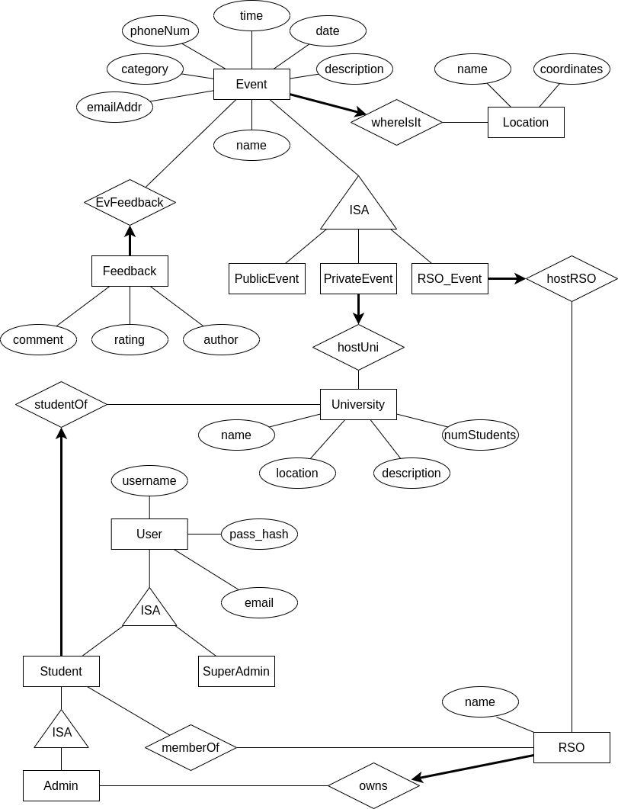

# Constraints outside Diagram

The constraints that involve permissions can't be enforced in the above design. I can enforce them outside the database by writing logic to determine whether a user can do a certain action.
