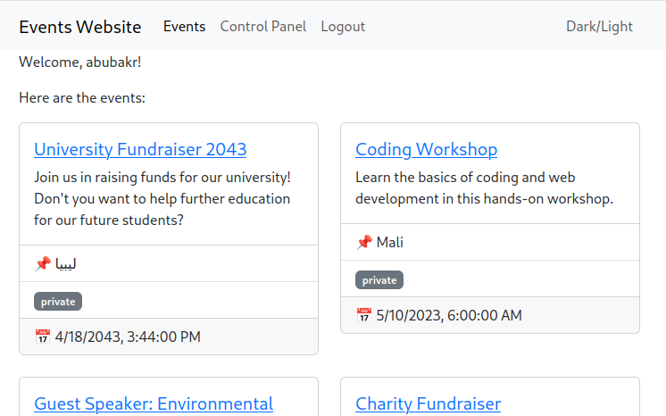
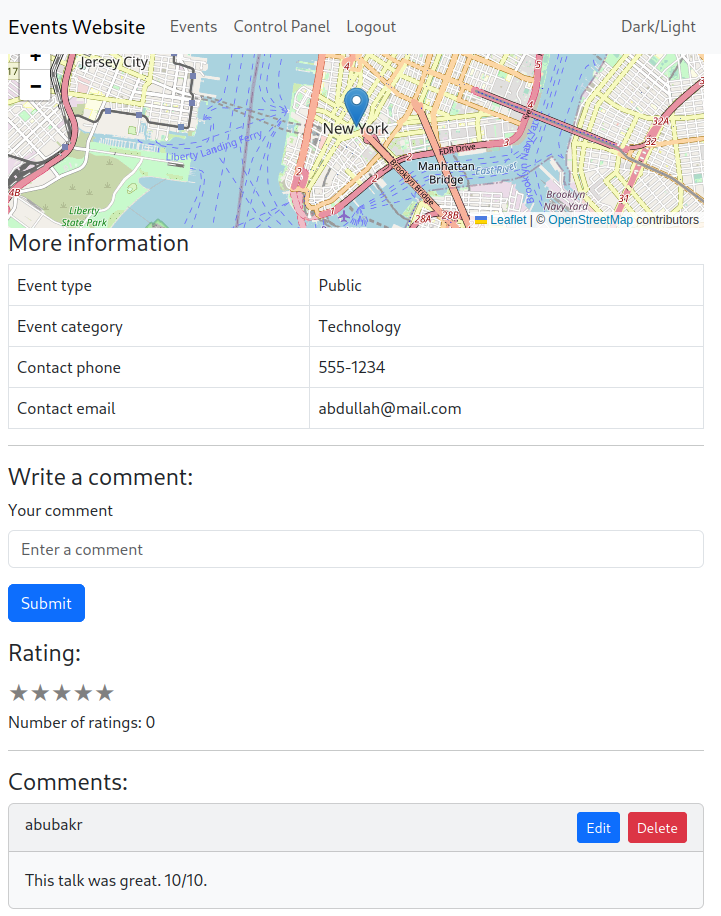
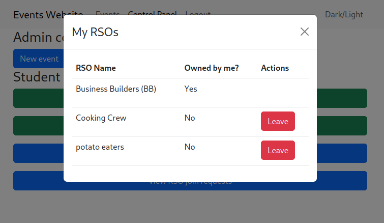
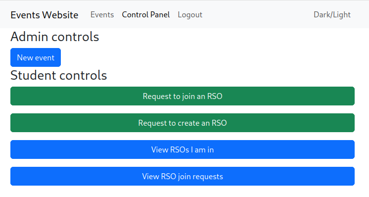
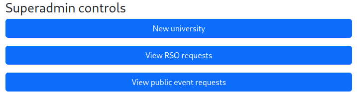

# College Event Website

Project for Database Systems class at UCF.

This is a website for events around a college campus. Users can create accounts, view events, and create events. Users see different events depending on the universities and organizations they are part of. More details in [report](submissions/Project%20Report.pdf).

Screenshots

---

---

---

---

---

## Usage

### Database setup

1. Set up Postgres database
2. Run setupDatabase.sql on database

to do: instructions for adding initial data

### Running the application

1. Open a shell in the backend directory and another in the frontend directory
2. In the backend directory, create a `.env` file defining these variables:
	- `DATABASE_CONNECTION_STRING` Postgres connection string
	- `JWT_SECRET` a secret string of your choice
3. Run `npm install` in both shells
4. Run `npm run dev` in both shells
5. Open http://localhost:5173/ in a browser to see the application
